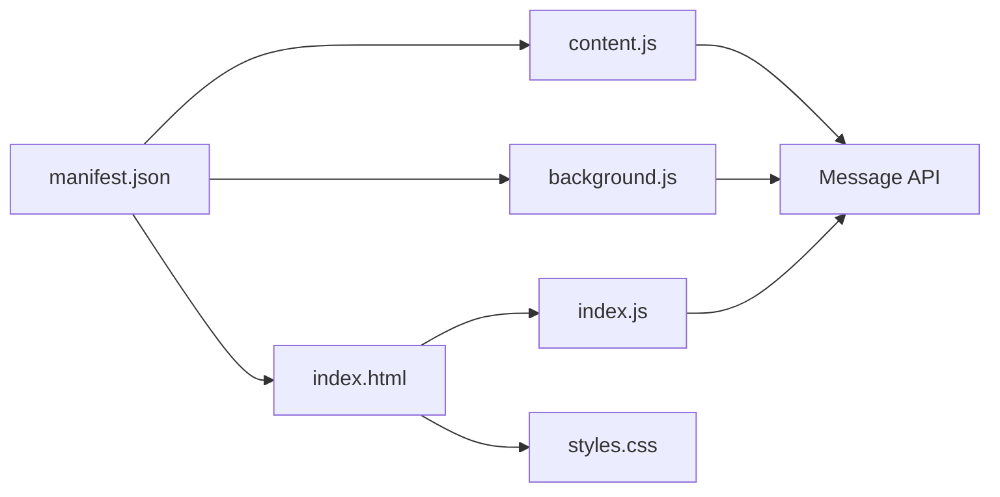

# 📋 Technical Requirements & Dependencies

## 🌐 Browser Compatibility

### **Minimum Chrome Version**
- **Chrome 88+** (Required for Manifest V3 support)
- **Chromium-based browsers** (Edge, Brave, Opera) with Manifest V3 support

### **Extension Manifest**
- **Manifest Version**: 3 (latest Chrome extension standard)
- **Service Worker**: Background script using modern service worker API
- **Content Script**: ES6+ JavaScript with modern DOM APIs

## 🛠️ Technical Stack

### **Frontend Technologies**
```json
{
  "html": "HTML5 with semantic markup",
  "css": "CSS3 with custom properties (CSS variables)",
  "javascript": "ES6+ (async/await, arrow functions, destructuring)"
}
```

### **Chrome Extension APIs**
```javascript
// Required Chrome Extension APIs
chrome.runtime.onMessage      // Message passing between scripts
chrome.tabs.query             // Tab management and communication  
chrome.tabs.sendMessage       // Send messages to content scripts
chrome.storage.local          // Local storage (optional)
```

### **DOM APIs**
```javascript
// Modern DOM manipulation
document.getElementById()
document.createElement()
document.createElementNS()    // SVG icon creation
Element.appendChild()
Element.setAttribute()
```

## 📦 Extension Structure

### **Core Files**
```
chrome-extension/
├── manifest.json             # Extension configuration (Manifest V3)
├── index.html               # Popup interface (350px width)
├── styles.css               # CSS with custom properties
├── index.js                 # Popup logic & message handling
├── content.js               # Main automation script
├── background.js            # Service worker
└── image.png               # Extension icon
```

### **File Dependencies**


## 🔧 Development Environment

### **Required Tools**
- **Chrome Browser** (88+ with Developer Mode enabled)
- **Text Editor/IDE** (VS Code, Sublime, etc.)
- **Git** (for version control)

### **Optional Tools**
- **Chrome DevTools** (for debugging)
- **Extension Reloader** (for development workflow)

## 🚀 Runtime Dependencies

### **No External Libraries**
- **Vanilla JavaScript** - No jQuery, React, or other frameworks
- **Pure CSS** - No Bootstrap or CSS frameworks  
- **Native Chrome APIs** - No third-party extension libraries

### **Browser Permissions Required**
```json
{
  "permissions": [
    "activeTab",    // Access to current active tab
    "tabs",         // Tab management and lifecycle
    "storage"       // Local storage (optional)
  ],
  "host_permissions": [
    "https://www.indeed.com/*",     // Indeed US
    "https://indeed.com/*",         // Indeed US (alternate)
    "https://indeed.ca/*",          // Indeed Canada
    "https://indeed.co.uk/*"        // Indeed UK
  ]
}
```

## 🎨 CSS Requirements

### **CSS Custom Properties Support**
```css
/* Modern CSS features used */
:root { }                    /* CSS custom properties */
display: flex;               /* Flexbox layout */
display: grid;               /* CSS Grid (if used) */
```

### **SVG Support**
- **SVG Icons**: Timeline icons created with `document.createElementNS()`
- **Inline SVG**: No external SVG files required

## 📱 UI/UX Specifications

### **Popup Dimensions**
```css
body {
  width: 350px;              /* Fixed Chrome extension popup width */
  min-height: 400px;         /* Minimum height for content */
  max-height: 600px;         /* Maximum height to prevent overflow */
}
```

### **Responsive Design**
- **Fixed Width**: 350px (Chrome extension standard)
- **Flexible Height**: Adapts to content
- **Timeline Scrolling**: Auto-scroll to bottom for new logs

## 🔒 Security Requirements

### **Content Security Policy (CSP)**
```json
{
  "content_security_policy": {
    "extension_pages": "script-src 'self'; object-src 'self'"
  }
}
```

### **Permissions Justification**
- **activeTab**: Required for automation on current Indeed tab
- **tabs**: Needed for tab lifecycle management and safety controls
- **storage**: Optional - for saving user preferences

## 🧪 Testing Requirements

### **Manual Testing**
- Extension installation and loading
- Popup interface functionality
- Start/stop button operations
- Console log display in timeline
- Emergency stop functionality (`Ctrl+Shift+X`)

### **Browser Testing**
- **Chrome 88+**: Primary target
- **Edge**: Chromium-based compatibility
- **Brave**: Extension compatibility testing

## 📊 Performance Considerations

### **Memory Usage**
- **Minimal footprint**: No heavy libraries or frameworks
- **Event-driven**: Service worker sleeps when inactive
- **Efficient DOM**: Limited DOM manipulation in popup

### **Message Passing**
- **Async communication**: Non-blocking message passing
- **Error handling**: Graceful degradation on message failures
- **Rate limiting**: Built-in delays to prevent spam

## 🔄 Version Compatibility

### **Backward Compatibility**
- **Manifest V3**: Modern standard (no V2 support needed)
- **ES6+**: Modern JavaScript (no IE support needed)
- **Chrome APIs**: Latest stable APIs

### **Future Proofing**
- **Service Worker**: Future-ready background script architecture
- **CSS Custom Properties**: Modern styling approach
- **Modular Code**: Easy to extend and maintain

## 🚨 Known Limitations

### **Browser Restrictions**
- **Chrome Extensions Only**: Does not work as web app
- **Indeed Domain**: Only operates on Indeed websites
- **Same Origin**: Cannot access cross-origin resources

### **API Limitations**  
- **Tab Permissions**: Requires user interaction for tab access
- **Content Script**: Limited to Indeed pages only
- **Storage**: Chrome extension storage limits apply

---

**Last Updated**: September 19, 2025
**Chrome Extension Manifest**: Version 3
**Minimum Chrome Version**: 88+